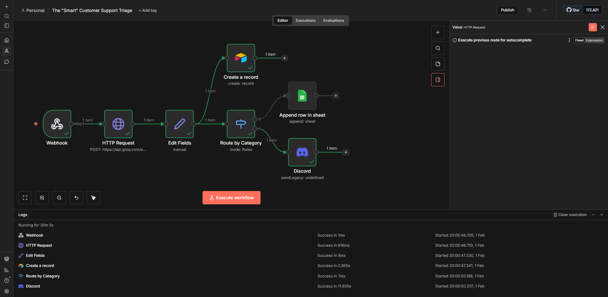
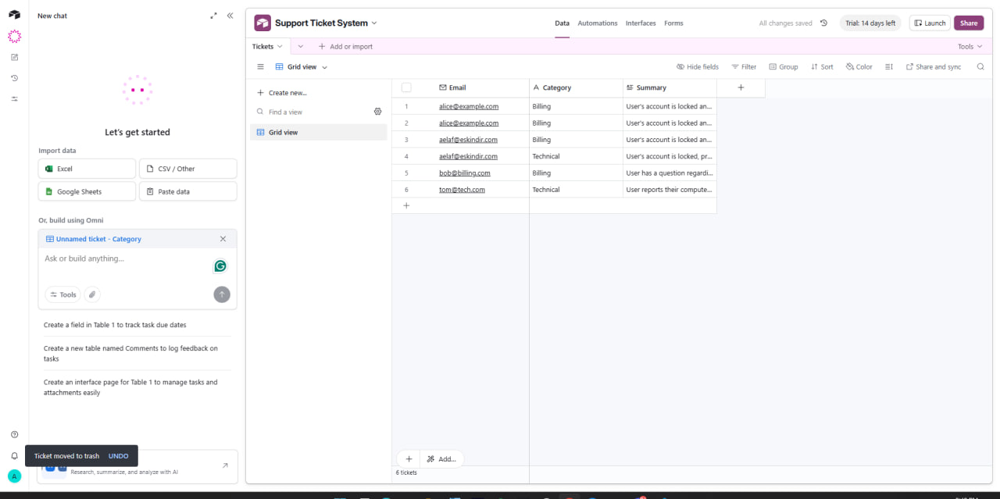
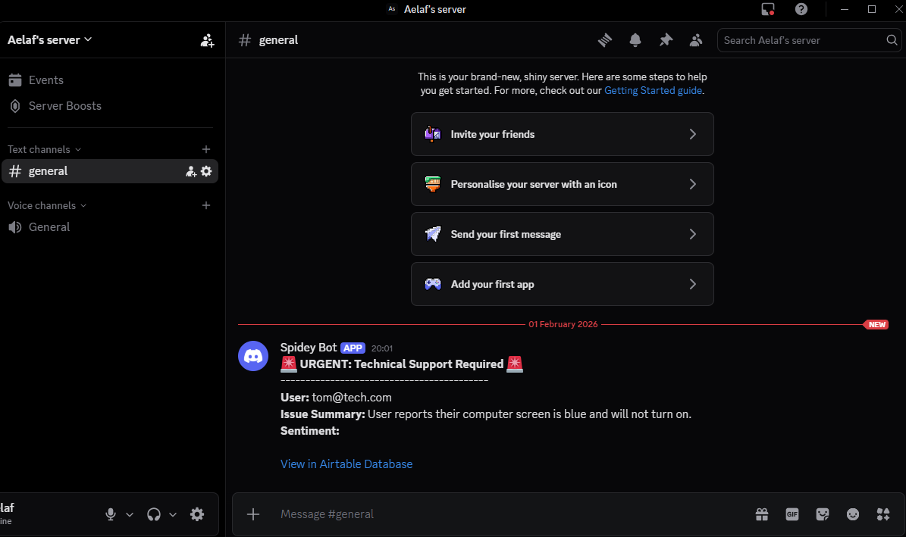
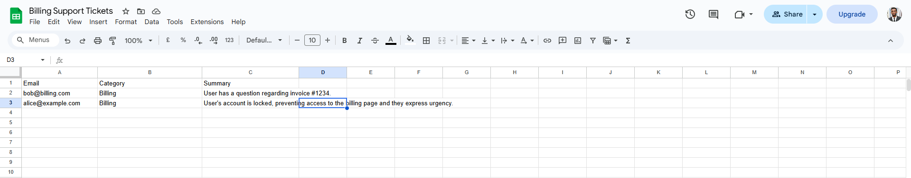

# AI-Powered Customer Support Triage System (n8n + Groq)

This project is a high-speed, automated backend designed to handle incoming customer support requests. By leveraging Large Language Models (LLMs) and workflow automation, the system categorizes, summarizes, and routes tickets to appropriate departments instantly, reducing manual triage time to zero.

## 🚀 System Architecture
The workflow follows a "Job-Ready" architectural pattern, ensuring data is never lost and high-priority issues are escalated immediately.

1.  **Ingress (HTTPS Webhook)**: Receives customer data via a secure POST request (tunneled through ngrok for local development).
2.  **Intelligence (Groq API)**: Processes the raw message using the **Llama-3-8b** model. It performs sentiment analysis and classifies the ticket into categories: `Billing`, `Technical`, or `General`.
3.  **Data Extraction**: Uses JavaScript expressions to parse the AI's JSON output into usable variables.
4.  **Database Logging (Airtable)**: Acts as the "Master Log," recording every ticket for long-term storage and audit trails.
5.  **Conditional Routing (Switch Logic)**:
    *   **Billing Branch**: Appends data to a **Google Sheet** via a Service Account for the Finance team.
    *   **Technical Branch**: Triggers a **Discord Webhook** alert for the Engineering team.
6.  **Response**: Returns a 200 OK status to the client with the Ticket ID and AI-determined category.

## 🛠️ Tech Stack
- **n8n**: Workflow automation (Self-hosted via Docker).
- **Groq Cloud**: Llama 3 8B model for high-speed, sub-second text analysis.
- **Airtable**: Relational database for master ticket management.
- **Google Sheets API**: Integrated via Google Service Account.
- **Discord**: Real-time team alerting via Webhooks.
- **ngrok**: Secure HTTPS tunneling.

## 📸 Workflow Preview

### 1. The n8n Workflow Canvas

*The end-to-end logic from Webhook entry to departmental branching.*

### 2. Master Database (Airtable)

*Centralized logging of every request with AI summaries.*

### 3. Departmental Alerts (Discord & Google Sheets)


*Targeted routing: Discord for Technical issues, Sheets for Billing.*

## 🧪 Testing & Validation
To validate the system, use the following `curl` commands in your terminal. 

### Test Case 1: Billing Issue
*Expected Outcome: Logged in Airtable and added to Google Sheets.*
```cmd
curl -X POST https://YOUR_NGROK_URL/webhook-test/support-ticket -H "Content-Type: application/json" -d "{\"name\": \"Alice\", \"email\": \"alice@example.com\", \"message\": \"I was charged twice for my subscription. Please help!\"}"
```
### Test Case 2: Technical Issue
*Expected Outcome: Logged in Airtable and alert sent to Discord.*
```cmd
curl -X POST https://YOUR_NGROK_URL/webhook-test/support-ticket -H "Content-Type: application/json" -d "{\"name\": \"Bob\", \"email\": \"bob@tech.com\", \"message\": \"I cannot log in to the dashboard. It shows a 404 error.\"}"
```
## 🛡️ Reliability & Error Handling
This project demonstrates professional-grade reliability practices:
- **On-Error Continuation**: The Groq node is set to "Continue on Fail" to ensure that even if the AI is down, the raw customer message is still saved to Airtable.
- **Secure Authentication**:
  - Uses Service Accounts for Google Sheets (avoiding OAuth redirect issues).
  - Uses Header Authentication (Bearer tokens) for Groq.
  - Uses Webhooks for Discord to avoid the overhead of full Bot management.
- **JSON Enforcement**: The LLM is forced into "JSON Mode" to ensure the automated logic never breaks due to unstructured text.
## 📦 Installation
1. **Clone this repository.**
2. **Import the Workflow**: Open n8n, go to "Workflows" > "Import from File," and select customer_support_triage.json.
3. **Configure Credentials**:
  - Add your Groq API Key in the HTTP Request node.
  - Add your Airtable Personal Access Token.
  - Add your Google Service Account JSON and share your Sheet with the service account email.
  - Paste your Discord Webhook URL in the Discord node.
4. **Activate**: Click the "Execute Workflow" button to start listening for requests.

## ⚙️ Post-Import Configuration
After importing the `customer_support_triage.json` file into n8n, you must update the following placeholders with your own IDs to make the workflow functional:

### 1. Google Sheets
- **Node**: `Google Sheets Billing Log`
- **Field**: `Document URL` or `ID`
- **Action**: Replace `YOUR_GOOGLE_SHEET_ID` with the ID from your spreadsheet URL (the string between `/d/` and `/edit`).

### 2. Airtable
- **Node**: `Airtable Logging`
- **Field**: `Base` and `Table`
- **Action**: Use the dropdown menus to select your specific Base and Table. This will replace the `YOUR_AIRTABLE_BASE_ID` placeholders.

### 3. Webhooks
- **Node**: `Webhook` and `Discord Alert`
- **Action**: n8n will generate a unique Webhook URL for you. Make sure to update your `curl` commands and Discord settings with your specific generated IDs.
